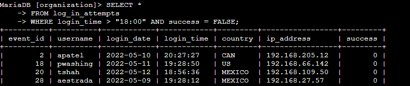

## **Project description**

This project focused on using SQL queries to apply filters for two main purposes: investigating suspicious login activity and identifying specific employee groups for targeted system updates. By applying logical operators and pattern matching, I was able to narrow large datasets into precise, actionable results. These queries ensured that security investigations were focused and that update rollouts were both accurate and efficient.

## **Retrieve after hours failed login attempts**

A potential incident occurred outside of business hours, and I needed to find all failed login attempts after 18:00.  
The following query selects all records where the *login\_time* is later than 18:00 and the *success* field equals FALSE)failed attempt). This output helps pinpoint unauthorized or suspicious login activity during off-hours.

## **Retrieve login attempts on specific dates**

I examined login data for both the date of the suspected activity and the preceding day to identify related events.

(./screenshots/02-login-specific-dates.png)

Using the *AND* operator returns all login attempts from both of the two specified dates, enabling comparison between days for repeated patterns. Adding *ORDER BY login\_date , login\_time* sorts the output first by date and then by time, ensuring that events are reviewed in chronological order- an important step when reconstructing incident timelines.

## **Retrieve login attempts outside of Mexico**

Some investigations require filtering out normal, expected traffic. Since the majority of logins from Mexico were legitimate, I excluded them.

![][image3]

With the *NOT LIKE ‘MEX%’* i was able to remove results where the country starts with *MEX*, covering both the abbreviation *MEX* and the full name *MEXICO*.

## **Retrieve employees in Marketing**

For targeted software updates, only Marketing employees located in the East building needed to be included.

![][image4]

The *AND* operator ensures both conditions are met-department must be Marketing, and the office must begin with “East” (capturing East-170,East-267,etc).

## **Retrieve employees in Finance or Sales**

Certain updates applied to both Finance and Sales departments.

![][image5]

The *OR* operator returns employees in either department.

## **Retrieve all employees not in IT**

Some updates were not relevant to the IT department and should be excluded.

![][image6]

Using the operator NOT excludes IT department staff from the results, ensuring updates reach only applicable users.

## **Summary**

This exercise demonstrated the use of SQL *WHERE* clauses combined with logical operators(*AND, OR*) and pattern matching(*LIKE, NOT*) to filter large datasets effectively. These queries enabled the identification of after-hours login anomalies, isolation of specific date ranges, and selection of precise employee groups for system updates. By focusing on relevant data, the process supports more efficient security investigations and targeted IT maintenance while minimizing unnecessary data exposures.

 
