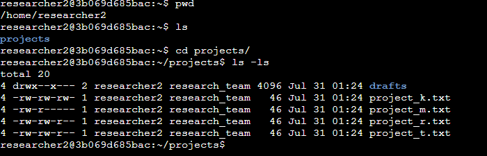
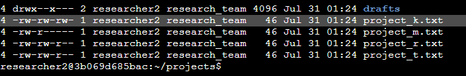
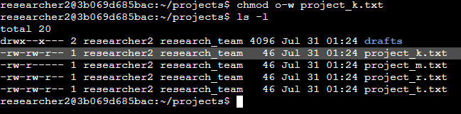
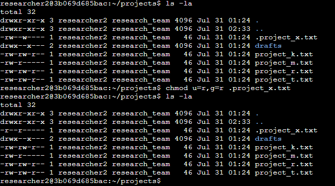
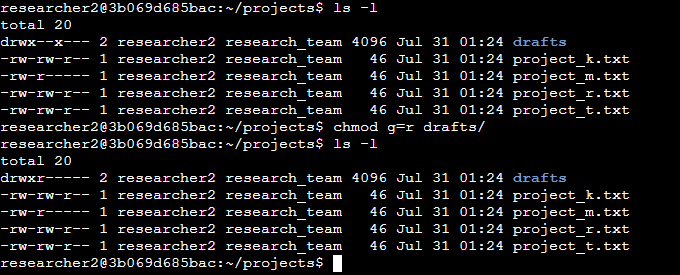

# 🐧 File Permissions in Linux

## Overview

As a security professional supporting a research team, existing file system permissions were audited and corrected to ensure they aligned with the organization's access control policies. Using Linux command-line tools, unauthorized permissions were identified and modified to enforce the principle of least privilege across files, hidden files, and directories.

---

## Scenario

> See [`scenario.md`](./scenario.md) for full context.

A security professional on a research team is tasked with reviewing and correcting file system permissions. The goal is to ensure that only authorized users have the appropriate level of access — and to remediate any permissions that deviate from organizational policy.

---

## Commands Used

| Command | Purpose |
|---|---|
| `ls -l` | List files and directories with permissions and ownership |
| `ls -la` | Include hidden files in the permission listing |
| `chmod o-w <file>` | Remove write access from others |
| `chmod u=r,g=r <file>` | Set read-only access for user and group |
| `chmod g=r <directory>` | Restrict group to read-only on a directory |

---

## Tasks & Findings

### 1. Check File and Directory Details

The `ls -l` command was run inside the `projects/` directory to reveal the permissions, ownership, and visibility of all contents.

```bash
ls -l
```



---

### 2. Describe the Permissions String

The permissions string of `project_k.txt` was analyzed: `-rw-rw-rw-`

```
- rw- rw- rw-
│  │   │   └── Others: read + write (no execute)
│  │   └────── Group:  read + write (no execute)
│  └────────── User:   read + write (no execute)
└───────────── Regular file (not a directory)
```



**Finding:** The `others` category had write access to `project_k.txt`, meaning users outside the research group could modify the file — a direct violation of the organization's security policy.

---

### 3. Change File Permissions

Write access was removed from `others` on `project_k.txt` using `chmod`:

```bash
chmod o-w project_k.txt
```



**Result:** Only the user and group retain write access, aligning with the organization's access control requirements.

---

### 4. Change Permissions on a Hidden File

The `ls -la` command was used to reveal hidden files (prefixed with `.`):

```bash
ls -la
```



`.project_x.txt` was found to be an archived hidden file requiring read-only access for both the user and group, with no write permissions for anyone. The following command was applied:

```bash
chmod u=r,g=r .project_x.txt
```

**Result:** Write access fully removed; the file is now read-only for both the owner and the group.

---

### 5. Change Directory Permissions

The `drafts/` directory was found with permissions `drwx--x---`, meaning the group had execute permission, which was not authorized.

```bash
chmod g=r drafts/
```



**Result:** The group's access is restricted to read-only. Only the owner retains full access to the directory.

---

## Summary

| Task | Command | Outcome |
|---|---|---|
| Audit file permissions | `ls -l` | Identified over-permissive access on `project_k.txt` |
| Audit hidden files | `ls -la` | Found `.project_x.txt` with unauthorized write permissions |
| Remove write from others | `chmod o-w project_k.txt` | Restricted to user and group only |
| Set read-only on hidden file | `chmod u=r,g=r .project_x.txt` | Write access fully removed |
| Restrict directory group access | `chmod g=r drafts/` | Group limited to read-only on `drafts/` |

This project reinforced the ability to interpret Linux permission strings, manage hidden files, and enforce secure access defaults — critical skills for any security role involving Linux system administration.

---

## Skills Demonstrated

| Skill | Applied |
|---|---|
| Linux CLI (`ls`, `chmod`) | ✅ |
| Permission string interpretation | ✅ |
| Hidden file management | ✅ |
| Principle of least privilege | ✅ |
| Access control enforcement | ✅ |

---

## Files

| File | Description |
|---|---|
|  | Full scenario context and task background |
|  | Terminal output captures for each task |
|  | Original project document |
