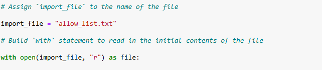
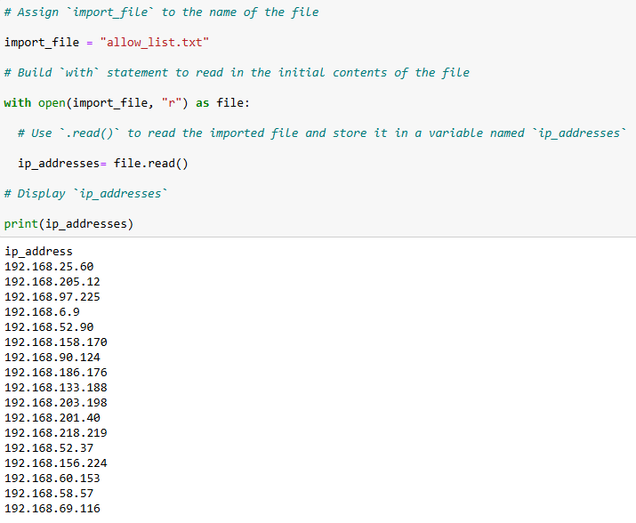
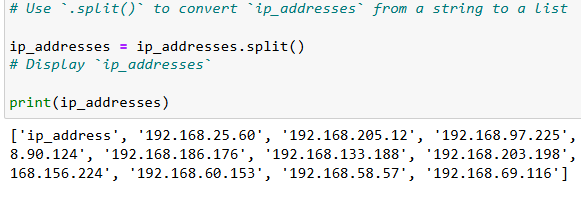
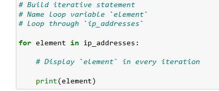
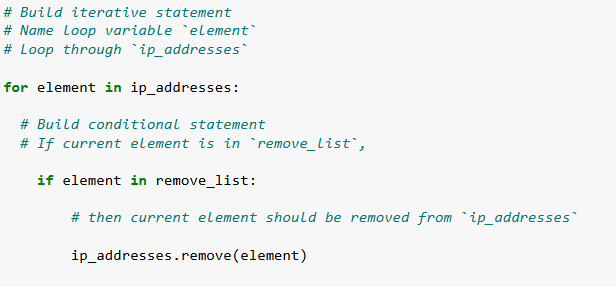
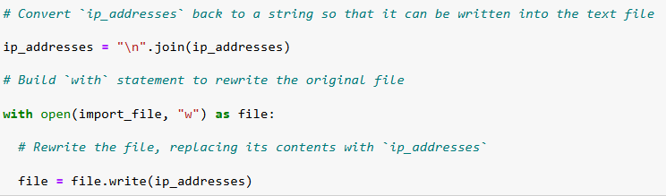

# 🐍 Algorithm for File Updates in Python

## Overview

A Python algorithm was developed to automate the maintenance of an IP allow list for a healthcare company's restricted subnetwork. The script reads the current allow list from a file, removes any IP addresses flagged for revocation, and rewrites the file with the updated set of authorized addresses — eliminating manual errors and enforcing access control policies consistently.

---

## Scenario

> See [`scenario.md`](./scenario.md) for full context.

Employees are granted access to restricted content (personal patient records) based on their IP address. When authorization is revoked, the employee's IP must be removed from the allow list promptly. This algorithm automates that revocation workflow end-to-end.

---

## The Algorithm

> Full source code: [`update_allow_list.py`](./update_allow_list.py)

The algorithm follows six sequential phases:

```
Open file → Read contents → Convert to list → Iterate → Remove IPs → Rewrite file
```

---

## Phases Breakdown

### Phase 1 — Open the Allow List File

```python
with open(import_file, "r") as file:
```



The `with` statement ensures the file is opened securely and automatically closed when the block completes — even if an error occurs. Opening in `"r"` (read mode) communicates clear intent: this is the data ingestion phase. No modifications are made at this stage. In cybersecurity, proper handling of sensitive files is crucial to avoid corruption, leakage, or inconsistent states.

---

### Phase 2 — Read the File Contents

```python
with open(import_file, "r") as file:
    ip_addresses = file.read()
```



The `.read()` method loads the entire content of the file into a single string variable called `ip_addresses`. At this point, the allow list is still unstructured raw text. By capturing the data into memory, the flexibility to manipulate it with Python's text-processing functions is gained — similar to how security analysts first collect logs or configuration files before parsing them into structured data.

---

### Phase 3 — Convert the String into a List

```python
ip_addresses = ip_addresses.split()
print(ip_addresses)
```



The `.split()` method separates the string wherever it finds whitespace, returning a list where every IP address becomes a distinct element. Printing the list immediately after is a debugging practice that confirms the text was correctly transformed into a structured list before applying further operations. This step represents the **normalization phase** of the workflow.

---

### Phase 4 — Iterate Through the Remove List

```python
for element in ip_addresses:
    print(element)
```



A `for` loop traverses every IP address stored in `ip_addresses`, sequentially assigning each to the variable `element`. The `print(element)` line is a debugging and validation step that ensures the loop is correctly traversing the list and displaying each IP before the removal logic is applied.

---

### Phase 5 — Remove IP Addresses on the Remove List

```python
for element in ip_addresses:
    if element in remove_list:
        ip_addresses.remove(element)
```



This is the **enforcement phase**. For each IP in the allow list, the `if` condition checks whether it appears in the `remove_list`. If `True`, `.remove(element)` deletes it from the list in place. Since allow lists are expected to contain unique values, one removal per match is sufficient to revoke access.

---

### Phase 6 — Update the File with the Revised List

```python
ip_addresses = "\n".join(ip_addresses)

with open(import_file, "w") as file:
    file.write(ip_addresses)
```



`.join()` converts the cleaned list back into a formatted string, placing each IP address on a new line to preserve the original file structure. The file is then reopened in `"w"` (write mode), which truncates the previous contents and overwrites it with the revised allow list. This is the **commit phase** — the system now reflects the most current set of approved IP addresses. By automating this write-back process, the algorithm eliminates manual errors and ensures that access policies are consistently enforced.

---

## Summary

| Phase | Operation | Method |
|---|---|---|
| 1 — Open | Secure file access | `with open(file, "r")` |
| 2 — Read | Load raw file contents into memory | `.read()` |
| 3 — Convert | Normalize string into structured list | `.split()` |
| 4 — Iterate | Traverse the allow list | `for` loop + `print()` |
| 5 — Remove | Enforce IP revocations | `.remove()` + `if` condition |
| 6 — Rewrite | Persist updated allow list to disk | `.join()` + `with open(file, "w")` |

By automating this critical access-control task, the algorithm reduces human error, enforces policy consistency, and provides a reusable function that can be integrated into larger security workflows.

---

## Skills Demonstrated

| Skill | Applied |
|---|---|
| Python file handling (`open`, `read`, `write`) | ✅ |
| String parsing (`.split()`, `.join()`) | ✅ |
| List iteration and conditional logic | ✅ |
| Debugging practices (`print` statements) | ✅ |
| Security automation (access control) | ✅ |
| Principle of least privilege | ✅ |
| Safe file handling (`with` statement) | ✅ |

---

## Files

| File | Description |
|---|---|
| [`scenario.md`](./scenario.md) | Full scenario context and security relevance |
| [`update_allow_list.py`](./update_allow_list.py) | Python source code for the algorithm |
| [`screenshots/`](./screenshots/) | Terminal and code output captures for each phase |
| [`docs/`](./docs/) | Original project write-up |
